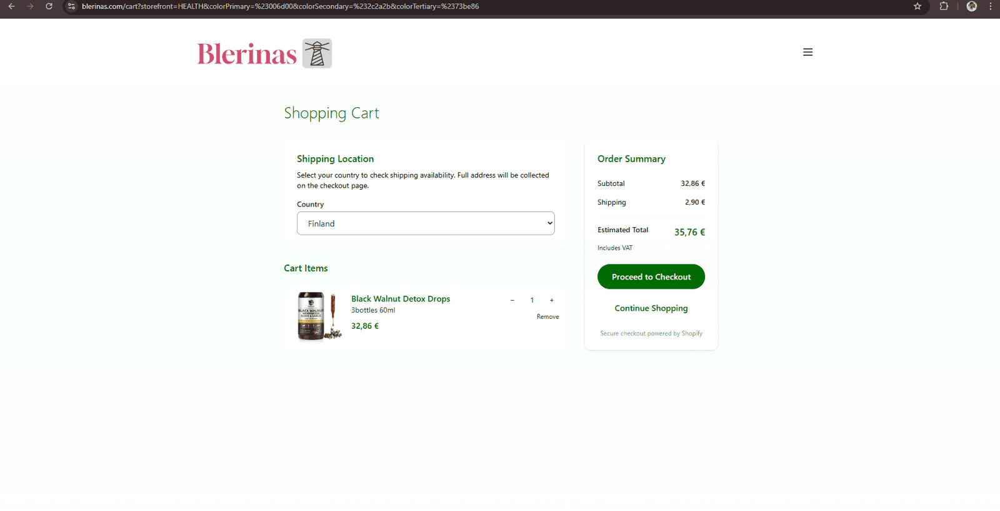
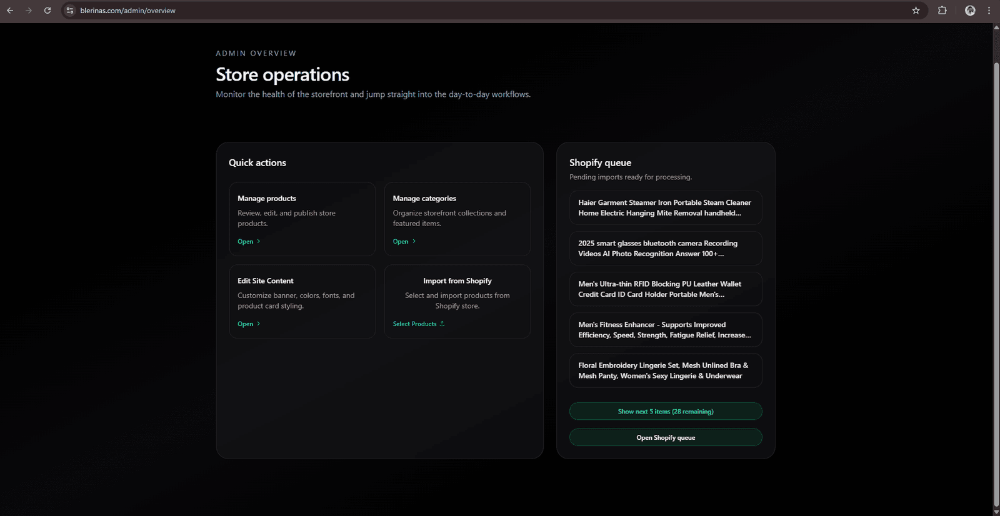
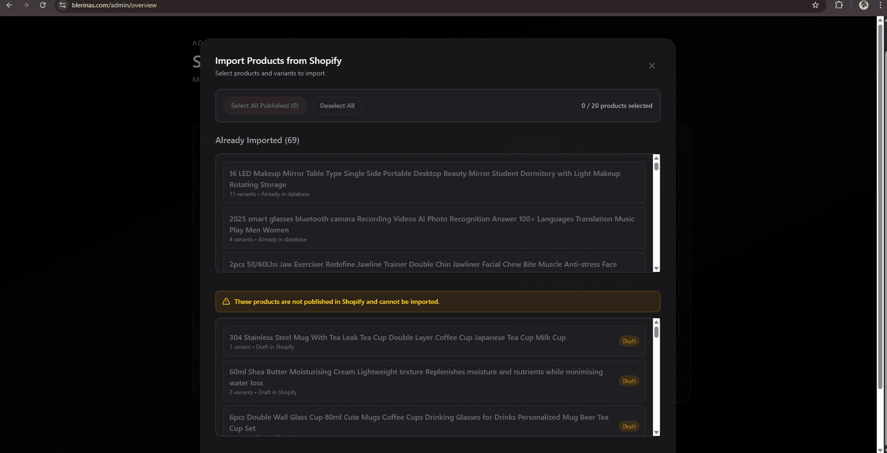
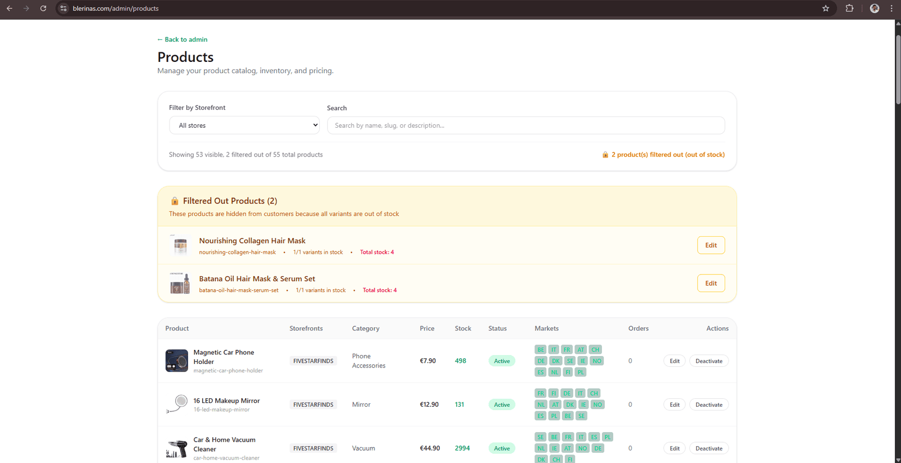

# Multi-Storefront E-commerce Platform


A Next.js multi-storefront e-commerce platform using Shopify as a headless backend and single source of truth. The system generates multiple independent storefronts, imports products from Shopify into an internal database, and serves market-specific catalogs.

After import, products go through a processing phase where they are assigned to storefronts and categories, configured with images, and prepared for launch with customer-facing content.

## AI-Powered Content Generation

The platform integrates with an AI microservice that automatically generates optimized product display names, marketing-ready descriptions, and bullet points from raw Shopify product data during the import process. This reduces manual content creation time significantly.

For detailed information about the AI system implementation, see the [CreateNameAndDescription repository](https://github.com/arben-grepi/CreateNameAndDescription).

## Platform Features

- **Multiple Storefronts**: Create unlimited independent storefronts, each with its own product catalog and branding
- **Shopify Integration**: Import products from Shopify as a headless backend for dropshipping
- **Product Customization**: Customize products (images, descriptions, pricing, variants) before launching to storefronts
- **Country-Based Routing**: Products are automatically filtered and displayed based on the user's country/market detected from their IP address
- **Editable Content**: Essential website text (company tagline, hero headings, descriptions) can be altered from the admin overview without code changes. Product information and hero text are rendered on the server for SEO optimization, ensuring search engines can index all product content without executing JavaScript
- **Real-Time Sync**: Webhooks synchronize Shopify backend information (shipping prices, stock levels, product updates) with the Next.js app in real-time

## Shopify-Handled Features

The platform leverages Shopify's infrastructure for:

- **Payment Processing**: Secure payment handling with support for multiple payment methods
- **Checkout System**: Complete checkout flow and order processing



*Checkout initiates in the Next.js app, then redirects to Shopify for secure payment processing*


*Final payment and order processing handled by Shopify*

- **Global Order Tracking**: Order management and fulfillment tracking
- **Shipping Rate Calculation**: Real-time shipping rates based on location and order details
- **Inventory Management**: Stock levels synchronized from Shopify's inventory system

## Technical Architecture

### Server-Side Rendering (SSR) Optimization

The application uses strategic SSR for SEO-critical content. Product information (names, descriptions, prices, variants) and hero text (company tagline, main heading, description) are fully rendered as HTML on the server before delivery. This makes content highly search-optimizable, as search engine crawlers can index all product information without executing JavaScript, significantly improving SEO rankings and discoverability.

**Content Storage & Configuration:**
- **Product Cards & Banners**: Component code is stored in the project, but styling configurations (card type, colors, fonts, sizes, border radius, columns) come from the database and are customizable via the admin dashboard
- **Banner Images**: Static image files stored in the project (`public/banners/`), but banner display settings (crop percentages, text width) are configured in the database
- **CSS & Styling**: All styling (color palettes, font selections, sizing) is stored in the database and can be customized per storefront through the admin interface

### Intelligent Middleware & IP-Based Routing

Custom Next.js middleware implements sophisticated routing logic:

- **IP Geolocation**: Automatically detects user's country from their IP address using external geolocation APIs
- **Market-Based Filtering**: Products are dynamically filtered based on detected market location and availability
- **Storefront Routing**: Intelligent path-based routing determines which storefront to serve (e.g., `/HEALTH`, `/FIVESTARFINDS`)
- **Cookie Memoization**: Detected market and storefront preferences are cached in cookies to minimize repeated geolocation requests

### Real-Time Stock Management

**Stock levels are synchronized in real-time from Shopify via webhooks. The system ensures customers only see products that are in stock and available in their market.**

### Backend Admin Dashboard



The comprehensive admin dashboard provides complete control over the platform:

- **Product Management**: Import products from Shopify queue, customize before launch (images, descriptions, pricing, variants), assign to storefronts and categories
- **Storefront Control**: Manage multiple storefronts from a single interface - assign products, configure branding, and control visibility
- **CSS & Styling Management**: Storefront-specific styling and CSS customization controlled from the admin interface - color palettes, fonts, product card styles (minimal, bordered, overlay, compact), banner settings, and all visual configurations are stored in the database
- **Category Management**: Create, edit, and organize product categories across all storefronts
- **Order Tracking**: Monitor orders, fulfillment status, and customer information
- **Content Editing**: Edit essential website text without code changes
- **Analytics & Metrics**: Track performance across storefronts and markets

All changes made in the admin dashboard are immediately reflected across the appropriate storefronts.

**Admin Dashboard Features:**

  
*Import products from Shopify into the staging area*

  
*Customize products before launching to storefronts*

  
*Configure colors, fonts, content, and styling without code changes*

## Multi-Storefront Architecture

The platform enables multiple independent storefronts through a shared component architecture:

**Shared Components:**
- Core React components (ProductCard, CategoryCard, ProductDetailPage, etc.) are shared across all storefronts
- Layout structure and routing logic are unified
- Admin dashboard serves as the central control point for all your storefronts. 

**Storefront-Specific Customization:**
- Each storefront has its own route path (e.g., `/HEALTH`, `/FIVESTARFINDS`)
- Product catalog is independently controlled - products are assigned to specific storefronts via the admin dashboard
- CSS and styling are storefront-specific, controlled from the backend admin app
- Branding assets (logos, banners, colors, fonts, product card styling) are isolated per storefront
- All customizations are persisted in the database and applied dynamically

This architecture allows rapid creation of new storefronts with minimal code duplication, as all storefronts share the same core application code and are differentiated only by configuration data stored in the database.

## Production Storefronts

Currently live storefronts:
- **HEALTH**: [https://blerinas.com/HEALTH](https://blerinas.com/HEALTH)
- **FIVESTARFINDS**: [https://blerinas.com/FIVESTARFINDS](https://blerinas.com/FIVESTARFINDS)


## Technologies

- **Next.js 16** (App Router) with React 19
- **Firebase** (Authentication, Firestore, Hosting)
- **Shopify** (Headless backend, Storefront API, Admin API)
- **Tailwind CSS 4** for styling

## Getting Started

### Prerequisites

- Node.js 18+
- Firebase project with Firestore enabled
- Shopify store with Storefront API access

### Installation

1. **Clone the repository:**
   ```bash
   git clone https://github.com/arben-grepi/ecomm_storefront_generator.git
   cd ecomm_storefront_generator
   ```

2. **Install dependencies:**
   ```bash
   npm install
   ```

3. **Configure environment variables:**
   Create a `.env.local` file with Firebase and Shopify credentials

4. **Run the development server:**
   ```bash
   npm run dev
   ```

5. **Open [http://localhost:3000](http://localhost:3000)** in your browser

## Deployment

Deployment is handled via **Firebase App Hosting** with automatic deployment when pushing to the `master` branch. Environment variables and secrets are managed through Google Cloud Secret Manager.
